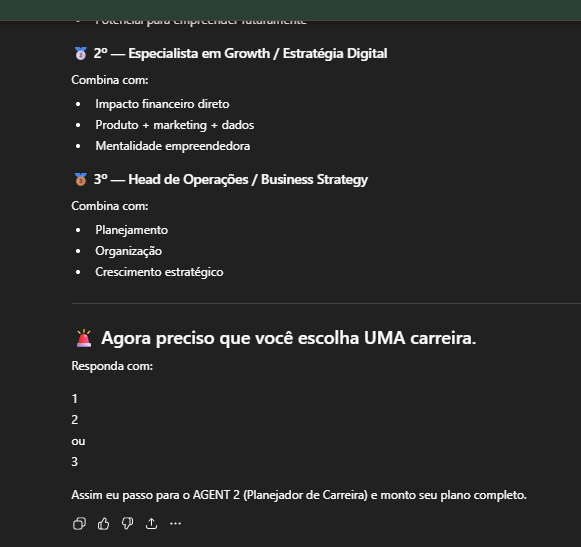
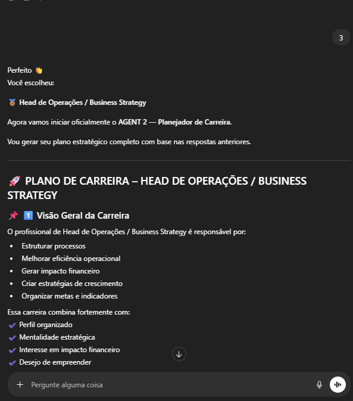
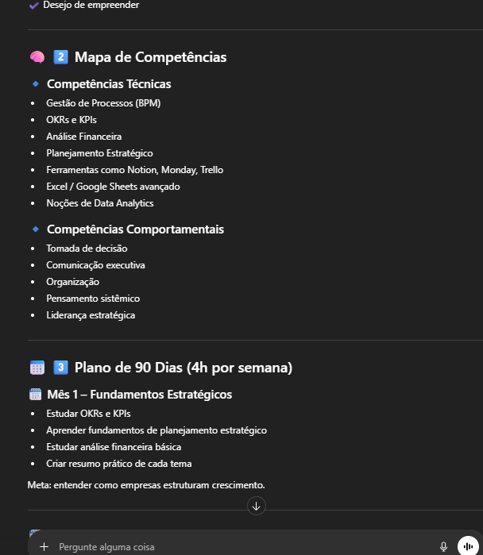
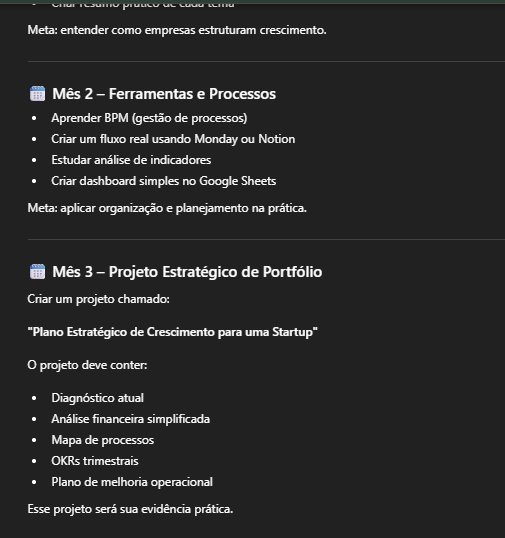

# copilot-prompts-carreira
Projeto DIO - Agentes de Carreira com prompts (Copilot/IA)
# 🚀 Projeto - Agentes de Carreira com IA

## 📌 Sobre o Projeto

Este projeto foi desenvolvido como parte do desafio da DIO utilizando os prompts do repositório "copilot-prompts".

A proposta foi simular dois agentes de IA:

- 🎤 AGENT 1 – Entrevistador de Carreira em Tecnologia  
- 🧠 AGENT 2 – Planejador Estratégico de Carreira  

O objetivo foi utilizar prompts estruturados para gerar um plano estratégico de crescimento profissional.

---

## 🎤 AGENT 1 – Entrevistador

O AGENT 1 realizou 7 perguntas sequenciais para entender meu perfil profissional:

- Disponibilidade semanal: 4h
- Experiência: Trabalho atualmente na área
- Objetivo: Crescer na carreira atual
- Preferência: Produto e estratégia
- Perfil: Organizada e planejadora
- Motivação: Gerar impacto financeiro
- Interesse: Empreender

### 🔝 Carreiras sugeridas:

1. Product Manager  
2. Especialista em Growth  
3. Head de Operações / Business Strategy  

Carreira escolhida: **Head de Operações / Business Strategy**

---

## 🧠 AGENT 2 – Planejador de Carreira

Com base na carreira escolhida, foi gerado um plano estruturado de desenvolvimento.

### 📅 Plano de 90 dias (4h semanais)

**Mês 1 – Fundamentos Estratégicos**
- Estudo de OKRs e KPIs
- Planejamento estratégico
- Análise financeira básica

**Mês 2 – Ferramentas e Processos**
- BPM (Gestão de Processos)
- Dashboard no Google Sheets
- Organização operacional

**Mês 3 – Projeto Estratégico**
Criação de um projeto prático:
Plano Estratégico de Crescimento para uma Startup

Incluindo:
- Diagnóstico
- Análise financeira
- OKRs trimestrais
- Plano de melhoria operacional

---

## 🎯 Objetivo Final

Evoluir para uma posição estratégica com foco em eficiência operacional, impacto financeiro e possibilidade futura de empreender.

---

## 📚 Aprendizados

- Como estruturar prompts claros e objetivos
- Como dividir problemas complexos em etapas
- Como utilizar IA para planejamento estratégico
- A importância de documentação no GitHub

---

## 📸 Evidências

## 📸 Evidências da Execução dos Agentes

### 🔹 1) Sugestão das 3 carreiras pelo AGENT 1

### 🔹 2) Escolha da carreira (Head de Operações / Business Strategy)

### 🔹 3) Início do Planejamento com AGENT 2

### 🔹 4) Plano de 90 dias gerado

### 🔹 5) Estratégia completa e direcionamento final

